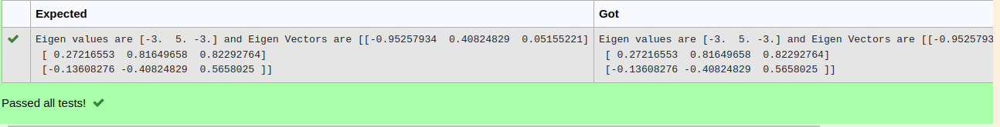

# EIGENVALUES-AND-EIGENVECTORS
## Aim:
To write a python program to find the Eigenvalues and Eigen Vectors
## Equipment’s required:
1. 	Hardware – PCs
2. 	Anaconda – Python 3.7 Installation / Moodle-Code Runner
## Algorithm:
### Step1 : 
import the math module
### Step 2: 
imput the array as list
### Step 3: Using the np.linalg.eig(),  we get two results (first is eigenvalue and second is eigenvector) of the given matrix.
### Step 4: 
print the result

## Program:
```
#Program to find the eigen values and eigen vectors.
#Developed by: harish ragavendra s
#RegisterNumber:22008967
import numpy as e
a=e.array([[-2,2,-3],[2,1,-6],[-1,-2,0]])
values,vectors=e.linalg.eig(a)
print("Eigen values are {} and Eigen Vectors are {}".format(values,vectors))
```

## Output:

## Result:
Thus the Eigenvalue and Eigenvector is successfully solved using python program
